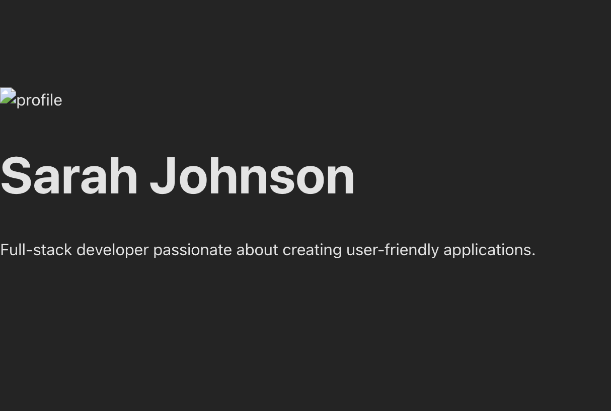

# Module 9A - Build Your First React Component

## Description
This is a React app created using Vite that renders a UserProfile component. The component includes a name, bio, and image styled with inline CSS.

## What I Learned
- How to set up a React project using Vite
- How to write and structure a functional React component
- How to use JSX and inline styles
- How to render a component in App.jsx

## Challenges
I initially saw the default Vite page and got errors because the dependencies were not installed. I fixed it by running `npm install` and restarting the dev server.

## Screenshot

